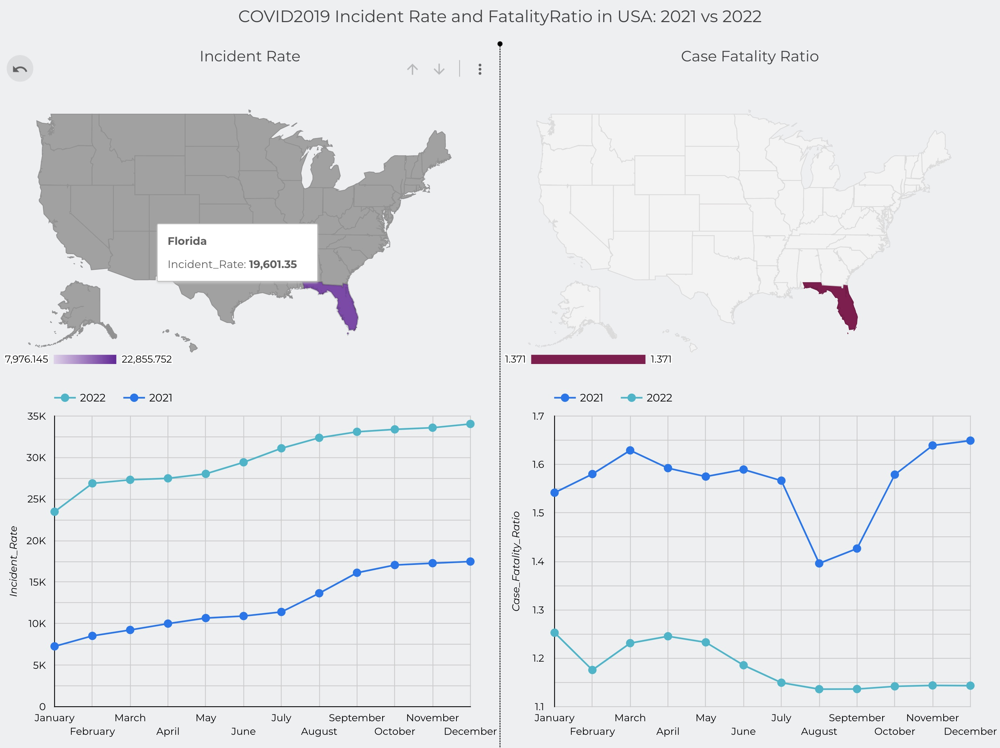

# Capstone project for Data Engineering Zoomcamp 2023


## Objective
The project makes use of the following technologies and create an automated anf reproducible dashboard.

## Technology stack
- Terraform
- Prefect
- BigQuery
- DBT
- GithubActions
- Looker Studio

## Dashboard Preview


## Bird's-eye view of the project

Initial dataset was gathered from [COVID-19 Data Repository by the Center for Systems Science and Engineering (CSSE) at Johns Hopkins University]("https://github.com/CSSEGISandData/COVID-19/tree/master/csse_covid_19_data") and stored in GCP Bucket. Then, data was ingested into BigQuery tables and transformed with DBT for further visualization in Looker Studio.

Here is the scheme of the final table:

```
  - name: tidy_data
    description: "Cleaned subset"
  - name: year2021
    description: "Cleaned subset"
    columns:
      - name: State
        description: "The name of the State within the USA"
      - name: Confirmed
        description: "Aggregated case count for the state"
      - name: Deaths
        description: "Aggregated death toll for the state"
      - name: Recovered
        description: "Aggregated Recovered case count for the state"
      - name: Active
        description: "Aggregated confirmed cases that have not been resolved (Active cases = total cases - total recovered - total deaths)"
      - name: Incident_Rate
        description: "Cases per 100,000 persons"
      - name: Case_Fatality_Ratio
        description: "Number recorded deaths * 100/ Number confirmed cases"
      - name: Testing_Rate
        description: "Total test results per 100,000 persons. The 'total test results' are equal to 'Total test results (Positive + Negative)'"
      - name: Date
        description: "Date of report"
      - name: Month
        description: "Month of report"
      - name: Year
        description: "Year of report"
```

## Deployment
Prerequisites:
- Google Cloud Platform account
- Prefect Cloud account

1. Fork the repo  
2. Setup three Github Actions Secrets:
    - GCP_SA_KEY (service account key)
    - PREFECT_WORKSPACE
    - PREFECT_API_KEY

3. Deployment of GCP infrastructure and execution of Prefect workflows is performed by the:
4. Run two GitHub Actions:
    - [Deploy GCP infrastructure]("https://github.com/biomlds/dez-capstone-project-2023/actions/workflows/run_terraform.yaml")
    - [Run all Prefect flows]("https://github.com/biomlds/dez-capstone-project-2023/actions/workflows/run_prefect_all_flows.yaml")
5. Upon sucessfull compleation of infrastrucure provisioning and data preparatin the dashbord is accessible by this link:

    ```
    https://lookerstudio.google.com/reporting/05b40761-9ab2-47f8-ae45-166f806db970/page/uWtLD/preview/create?
    c.reportId=6fef370e-0b3b-4bca-8e12-b0c01c57ad47
    &r.reportName=MyNewReportCOVID
    &ds.ds0.connector=bigQuery
    &ds.ds0.datasourceName=cluster_table
    &ds.ds0.projectId=dez-capstone-2023
    &ds.ds0.type=TABLE
    &ds.ds0.datasetId=covid
    &ds.ds0.tableId=cluster_table
    ```