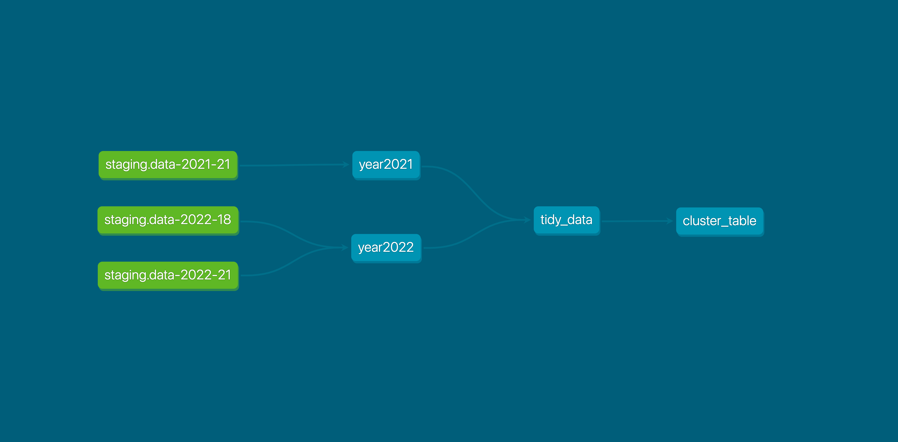

# [Capstone project for Data Engineering Zoomcamp 2023]('https://github.com/DataTalksClub/data-engineering-zoomcamp')

[](https://github.com/biomlds/dez-capstone-project-2023/actions/workflows/run_prefect_all_flows.yaml)
[](https://github.com/biomlds/dez-capstone-project-2023/actions/workflows/run_terraform.yaml)

## Objective
The project makes use of the following technologies and create an automated and reproducible dashboard.

## Technology stack
- [Terraform](https://www.terraform.io/)
- [Prefect](https://www.prefect.io/)
- [BigQuery](https://cloud.google.com/bigquery)
- [DBT](https://www.getdbt.com/)
- [GithubActions](https://docs.github.com/en/actions)
- [Looker Studio](https://lookerstudio.google.com/navigation/reporting)

## Dashboard Preview


## Bird's-eye view of the project

Initial dataset was gathered from [COVID-19 Data Repository by the Center for Systems Science and Engineering (CSSE) at Johns Hopkins University](https://github.com/CSSEGISandData/COVID-19/tree/master/csse_covid_19_data) and stored in GCP Bucket. Then, data was ingested into BigQuery tables and transformed with DBT for further visualization in Looker Studio.

Two complete years of observation (year2021, year2022) were transformed into clustered table.


Here is the scheme of the table:
```
  columns:
      - name: State
        description: "The name of the State within the USA"
      - name: Confirmed
        description: "Aggregated case count for the state"
      - name: Deaths
        description: "Aggregated death toll for the state"
      - name: Recovered
        description: "Aggregated Recovered case count for the state"
      - name: Active
        description: "Aggregated confirmed cases that have not been resolved (Active cases = total cases - total recovered - total deaths)"
      - name: Incident_Rate
        description: "Cases per 100,000 persons"
      - name: Case_Fatality_Ratio
        description: "Number recorded deaths * 100/ Number confirmed cases"
      - name: Testing_Rate
        description: "Total test results per 100,000 persons. The 'total test results' are equal to 'Total test results (Positive + Negative)'"
      - name: Date
        description: "Date of report"
      - name: Month
        description: "Month of report"
      - name: Year
        description: "Year of report"
```

## Deployment
0. Prerequisites:
    - [Google Cloud Platform account](https://cloud.google.com/)
    - [Prefect Cloud account](https://prefect.cloud)

1. Fork the repo  
2. Setup three Github Actions Secrets:
    - GCP_SA_KEY (service account key)
    - PREFECT_API_KEY (Prefect Cloud API key)
    - PREFECT_WORKSPACE (a combination of your account/workspace)
    
3. Run two GitHub Actions to deploy GCP infrastructure and execute Prefect workflows:
    - [Deploy GCP infrastructure](https://github.com/biomlds/dez-capstone-project-2023/actions/workflows/run_terraform.yaml)
      - this provision GCP Storage bucket and BigQuery
    - [Run all Prefect flows](https://github.com/biomlds/dez-capstone-project-2023/actions/workflows/run_prefect_all_flows.yaml) to trigger these flows:
      - `make_blocks.py` creates all required [blocks](https://docs.prefect.io/latest/concepts/blocks/) in your Prefect Cloud workspace.
      - `ingest_data.py` pushes data to Cloud Storage
      - `populate_bq.py` import raw data into BigQuery tables
      - `model_data.py` process the tables via DBT

5. Upon successful completion of infrastructure provisioning and data preparation the dashboard is accessible by this [link](https://lookerstudio.google.com/reporting/05b40761-9ab2-47f8-ae45-166f806db970/page/uWtLD/preview/create?c.reportId=6fef370e-0b3b-4bca-8e12-b0c01c57ad47&r.reportName=MyNewReportCOVID&ds.ds0.connector=bigQuery&ds.ds0.datasourceName=cluster_table&ds.ds0.projectId=dez-capstone-2023&ds.ds0.type=TABLE&ds.ds0.datasetId=covid&ds.ds0.tableId=cluster_table):

```
https://lookerstudio.google.com/reporting/05b40761-9ab2-47f8-ae45-166f806db970/page/uWtLD/preview/create?
c.reportId=6fef370e-0b3b-4bca-8e12-b0c01c57ad47
&r.reportName=MyNewReportCOVID
&ds.ds0.connector=bigQuery
&ds.ds0.datasourceName=cluster_table
&ds.ds0.projectId=dez-capstone-2023
&ds.ds0.type=TABLE
&ds.ds0.datasetId=covid
&ds.ds0.tableId=cluster_table
```

## To do
- lint and format code
- replace Looker with Streamlit dashboard
